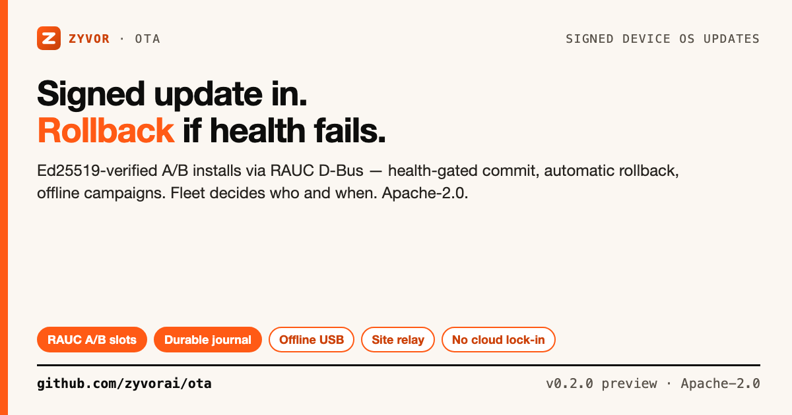

# Zyvor OTA

[](https://github.com/zyvorai/ota/actions/workflows/ci.yml)
[](https://github.com/zyvorai/ota/actions/workflows/release.yml)
[](go.mod)
[](LICENSE)



**Signed update in. Rollback if health fails.**

📖 **[15-minute trial](docs/TUTORIAL.md)** · **[User guide](docs/USER-GUIDE.md)** · **[Architecture](docs/ARCHITECTURE.md)** · **[Operations](docs/OPERATIONS.md)**

The open OTA runtime for Linux edge fleets: Ed25519-signed releases, RAUC A/B installs, health-gated commit, automatic rollback, offline campaigns, and verifiable evidence — without cloud lock-in. **Fleet decides which devices and when.** This repo is the install agent only, not a second rollout controller.

> **Maturity (honest):** **v0.2.0 engineering preview** — working Go agent and CLI, RAUC D-Bus adapter, simulator, CI, and **generic QEMU RAUC lab HIL** signed ([docs/HIL.md](docs/HIL.md) Track A). **Minewing GW1 r1 silicon qualification remains unsigned** ([docs/PRODUCTION.md](docs/PRODUCTION.md)). Evaluate accordingly if you need that board qualified today.

New here? [`docs/FAQ.md`](docs/FAQ.md) · [`docs/TROUBLESHOOTING.md`](docs/TROUBLESHOOTING.md)

## Contents

- [Is this for you?](#is-this-for-you)
- [Run the simulator demo](#run-the-simulator-demo)
- [Implemented](#implemented)
- [Scope matrix](#scope-matrix)
- [Device deployment](#device-deployment)
- [Remote smoke-deploy](#remote-smoke-deploy)
- [Repository guide](#repository-guide)
- [Contributing & security](#contributing--security)
- [License](#license)

## Is this for you?

| | **Zyvor OTA** | Mender | SWUpdate | balena | Roll-your-own |
|---|---|---|---|---|---|
| Scope | Signed A/B install agent | Agent + optional server | Embedded framework | Fleet + container OS | Scripts |
| Mechanism | RAUC A/B slots | A/B or single | A/B or custom | balenaOS | apt/dpkg, no atomicity |
| Rollback | Health-gated + `NeedsRecovery` | Automatic (A/B) | Integration-dependent | Automatic | Usually none |
| Fleet/targeting | Zyvor Fleet (`docs/FLEET.md`) | Mender server | hawkBit/custom | balenaCloud | You build it |

*(Verify licensing/features against each project's docs.)*


## Run the simulator demo

Requirements: Linux, Go 1.27.1+ (1.24 language minimum), Python 3, GCC for race tests, `dbus-daemon` for protocol tests.

```sh
make build && make test && make demo && make ci
make status          # bin/otactl (= bin/zyvor-ota)
```

The demo uses the real daemon and CLI with temporary keys — no disk writes, no reboot, no Fleet contact. See [docs/TUTORIAL.md](docs/TUTORIAL.md) for the full walkthrough.

## Implemented

- Ed25519-signed release envelopes; pinned trust keys; digest, compatibility, expiry, sequence, idempotency.
- HTTPS downloads with allowlists, resumable ranges, bounded size, disk reserve, cache cleanup.
- Durable SQLite WAL journal and event outbox; terminal jobs archive safely.
- RAUC over D-Bus (`InstallBundle`, slot status, mark-good) — no shell update scripts.
- A/B install, controlled reboot, health probes (file, systemd, HTTP), rollback and recovery interlock.
- Unix-socket API, CLI, Prometheus; outbound Fleet contract; offline campaign export/import; site relay.
- systemd/polkit examples, CI, release SBOM/Cosign workflow.

## Scope matrix

| Capability | Status |
|---|---|
| Simulator install/reboot/rollback | Implemented, software tested |
| RAUC D-Bus protocol | Implemented; tested on private bus |
| Real signed RAUC on physical devices | Adapter done; board qualification required |
| SWUpdate `.swu` / MCU firmware | Not implemented |
| Fleet integration | Contract implemented; Fleet serves endpoints |
| QEMU lab HIL | Signed generic lab ([docs/QEMU-LAB.md](docs/QEMU-LAB.md)) |
| Minewing GW1 r1 power-loss | Unsigned |

Evidence: [docs/TEST-REPORT.md](docs/TEST-REPORT.md).

## Device deployment

Read [docs/DEVICE-INTEGRATION.md](docs/DEVICE-INTEGRATION.md) first. The image must already provide A/B slots, bootloader fallback, RAUC trust anchors, and recovery — this project does not repartition devices.

1. Build board image + `.raucb` (e.g. `boards/minewing-gw1-r1/`).
2. Match RAUC bundle and OTA release version; provision Ed25519 + RAUC trust.
3. Configure agent JSON; bake or install binaries/unit/D-Bus/polkit.
4. Submit signed assignment via Unix socket or Fleet; qualify per [docs/QUALIFICATION.md](docs/QUALIFICATION.md).

RAUC requires `allow_device_writes: true` and local health checks. Development flow uses `simulator` backend by default.

```sh
otactl keygen ./release-keys
otactl sign release.json release-keys/release.key production-1 envelope.json
otactl -socket /run/zyvor-ota/agent.sock submit assignment.json
```

Keep signing keys off the device.

## Remote smoke-deploy

[`scripts/deploy-remote.sh`](deploy/README.md) pushes a build over SSH, runs `make check && make demo`, and installs a **simulator** systemd service — it does not replace board RAUC deployment.

```sh
scripts/deploy-remote.sh HOST USER --key
make deploy-remote H=HOST U=USER
```

## Repository guide

| Directory | Purpose |
|---|---|
| `cmd/` | CLI and device daemon |
| `internal/ota/` | Engine, journal, verification, backends, Fleet |
| `boards/minewing-gw1-r1/` | Production SKU profile |
| `docs/` | Architecture, HIL, qualification, evidence |
| `docs/social/` | Share cards — `./docs/social/build-social-card.sh` |

See also [docs/LAB.md](docs/LAB.md) (Fleet + OTA + Device Agent lab stack) and [docs/ROADMAP.md](docs/ROADMAP.md).

## Contributing & security

[CONTRIBUTING.md](CONTRIBUTING.md) — evidence required for boot/signing/recovery changes. [SECURITY.md](SECURITY.md) — threat model and disclosure. Never post signing keys in public issues.

## License

Apache-2.0 — see [LICENSE](LICENSE). RAUC is an external runtime dependency, not relicensed here. Enterprise: [FAQ](docs/FAQ.md#community-and-enterprise) · [sales@zyvor.dev](mailto:sales@zyvor.dev).
