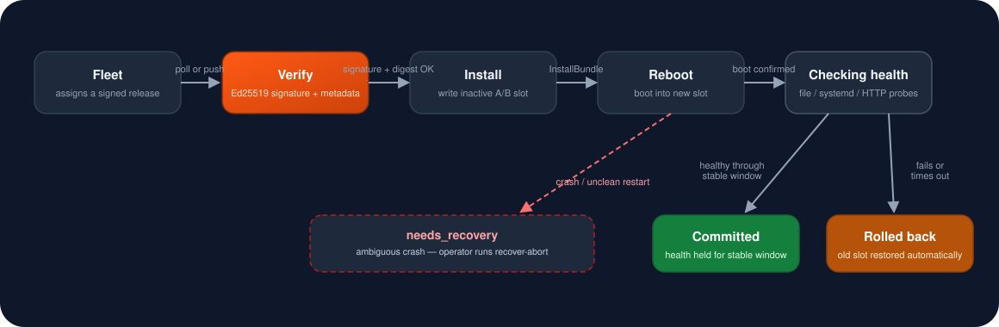

<div align="center">


# Zyvor OTA

### Signed, recoverable device OS updates for the Zyvor Platform.

[Tutorial](docs/TUTORIAL.md) · [User Guide](docs/USER-GUIDE.md) · [Architecture](docs/ARCHITECTURE.md) · [Operations](docs/OPERATIONS.md)

[](https://github.com/zyvorai/ota/actions/workflows/ci.yml)
[](https://github.com/zyvorai/ota/actions/workflows/release.yml)
[](go.mod)
[](LICENSE)

<br/>



</div>

**v0.1.0 — engineering preview, Apache-2.0.** This repository contains a working
Go agent and CLI, a native RAUC D-Bus adapter, an isolated simulator, and automated
tests. Physical board qualification is a separate release gate. See
[verification evidence](docs/TEST-REPORT.md) for exactly what ran.

Fleet decides **which devices and when**. OTA verifies and installs a device OS
release. RAUC writes the inactive slot and integrates with the board bootloader.

## Contents

- [Tutorial: your first simulator update](docs/TUTORIAL.md)
- [User guide: CLI and config reference](docs/USER-GUIDE.md)
- [Run the complete simulator demonstration](#run-the-complete-simulator-demonstration)
- [Implemented](#implemented)
- [Scope and support matrix](#scope-and-support-matrix)
- [Device deployment](#device-deployment)
- [Remote smoke-deploy](#remote-smoke-deploy)
- [Repository guide](#repository-guide)
- [Contributing](#contributing)
- [Security](#security)
- [License](#license)

## Run the complete simulator demonstration

Requirements: Linux, Go 1.27.1 or a newer supported patch (Go 1.24 is the language minimum),
Python 3 for the demo, GCC for race tests, and `dbus-daemon` for protocol tests.

```sh
make build
make test
make race
make vet
make demo
```

The demo generates temporary signing keys, starts a local artifact server and
the **real daemon and CLI**, installs two simulated releases, restarts the daemon
before reboot, commits the first release, rolls back the unhealthy second release,
rejects replay, acknowledges events, and cleans the cache. It never writes disks,
calls system reboot, or contacts a Fleet deployment. Temporary keys are deleted.

Use `make dist` to cross-compile static Linux AMD64 and ARM64 executables.
An ARM64 build is not evidence of execution on ARM64 hardware.

## Implemented

- Ed25519-signed exact-byte release envelopes; pinned device trust keys.
- SHA-256 and signed artifact sizes, exact board/backend compatibility, expiry,
  monotonic release sequence, job idempotency, and maintenance windows.
- HTTPS downloads with host allowlists, safe redirect checks, bounded size,
  disk reserve, resumable ranges, full digest verification, and cache cleanup.
- Durable single-writer state and event outbox using fsync + atomic rename.
- RAUC `InstallBundle`, `Completed`, `GetSlotStatus`, `GetPrimary`, and `Mark`
  over D-Bus. No shell commands or arbitrary update scripts are accepted by OTA.
- A/B install, controlled reboot, local health window, mark-good and rollback.
- Recovery interlock when an installation's outcome is ambiguous after a crash.
- Health confirmation on later normal boots of known installed versions.
- File, systemd-service and loopback HTTP health probes.
- Unix-socket operator API, CLI, and Prometheus text metrics.
- Outbound Fleet contract with TLS, optional custom CA/mTLS, token-file auth,
  ordered event acknowledgment, retry by polling, and no inbound cloud port.
- systemd and policy examples, API schema, CI, release build/SBOM/Cosign workflow.

## Scope and support matrix

| Capability | Status |
|---|---|
| Simulator install/reboot/rollback | Implemented and software tested |
| RAUC D-Bus wire protocol | Implemented; tested against a test service on a real private bus |
| Real signed RAUC bundles on physical devices | Adapter implemented; board qualification required |
| Kernel/rootfs/device tree/BSP | Delivered together through a board-built RAUC OS bundle |
| SWUpdate `.swu` | Not implemented in v0.1 |
| Standalone model/config/container/MCU updates | Not implemented in v0.1 |
| Bootloader update | Not enabled by this project; requires a qualified board recovery design |
| Fleet integration | Contract and transport implemented; existing Fleet server needs matching endpoints |
| QEMU bootable image | Not included; board integration examples are templates |
| Hardware power-loss testing | Not performed in this build environment |

## Device deployment

Read [device integration](docs/DEVICE-INTEGRATION.md) before using the RAUC backend.
The initial image must already provide redundant slots, a working bootloader
fallback policy, a shared persistent OTA state directory, RAUC trust anchors,
and a recovery method. This project does not repartition existing devices.

1. Build a board image and real `.raucb` with the BSP's image build system.
2. Give the RAUC bundle and signed OTA release the same unique version.
3. Provision the pinned Ed25519 public key and the RAUC X.509 trust anchor.
4. Configure `examples/agent.rauc.json` for the exact board and artifact host.
5. Install the binaries, unit, D-Bus policy and reboot policy on the image.
6. Start the agent and submit a signed assignment through its Unix socket or Fleet.
7. Qualify reboot, rollback and power interruption on the exact board revision.

The daemon defaults to the configured backend; the example development flow
explicitly uses `simulator`. RAUC requires `allow_device_writes: true` and at least
one local health check. Simulator releases cannot be installed by the RAUC backend.

```sh
zyvor-ota keygen ./release-keys
# Fill examples/release.json with the actual artifact URL, SHA-256, size and expiry.
zyvor-ota sign release.json release-keys/release.key production-1 envelope.json
# Embed envelope.json as the release field in assignment.json.
zyvor-ota -socket /run/zyvor-ota/agent.sock submit assignment.json
zyvor-ota -socket /run/zyvor-ota/agent.sock job job-001
zyvor-ota -socket /run/zyvor-ota/agent.sock reboot
```

Keep the signing private key off the device. Examples contain placeholders,
not working production credentials or pre-signed firmware.

## Remote smoke-deploy

`scripts/deploy-remote.sh` pushes a build to an arbitrary Linux host over SSH,
runs `make check && make demo` there, and installs it as a systemd service
running the simulator backend, then drives one real signed install/reboot/
commit job cycle against that live daemon. It never touches RAUC, D-Bus, or
real disks, and it does **not** replace the device deployment steps above —
see [`deploy/README.md`](deploy/README.md) for what it does and does not do.

```sh
scripts/deploy-remote.sh HOST USER --key
make deploy-remote H=HOST U=USER
```

## Repository guide

| Directory | Purpose |
|---|---|
| `cmd/` | Operator CLI and device daemon |
| `internal/ota/` | Engine, journal, verification, downloader, backends, API, Fleet |
| `api/` | OpenAPI and release JSON schema |
| `examples/` | Config/release/assignment templates |
| `boards/reference/` | RAUC slot/group and bundle templates, not a certified image |
| `packaging/` | systemd, D-Bus and polkit policy examples |
| `deploy/` | Remote smoke-deploy tooling (simulator backend, not board deployment) |
| `scripts/` | Daemon E2E test, release checksums, and remote deploy/selftest |
| `docs/` | Architecture, security, recovery, device qualification and test evidence |

See [architecture](docs/ARCHITECTURE.md), [Fleet contract](docs/FLEET.md),
[operations](docs/OPERATIONS.md), the [tutorial](docs/TUTORIAL.md), and the
[user guide](docs/USER-GUIDE.md). There is intentionally no second fleet
dashboard or competing application rollout controller in this repository.

## Contributing

See [CONTRIBUTING.md](CONTRIBUTING.md): Apache-2.0 SPDX headers, board profiles
scoped to a tested SKU/revision pair, and required evidence for any change to
boot selection, slot grouping, signing or recovery behavior. Run `make check`,
`make demo`, and `make dist` before opening a pull request.

## Security

See [SECURITY.md](SECURITY.md) for the threat model this agent defends and how
to report a suspected vulnerability. Never post signing keys, device
credentials, or exploitable production details in a public issue.

## License

Original Zyvor OTA source is Apache-2.0. Vendored dependencies retain their own
licenses. RAUC is an external runtime dependency and is not relicensed by this
repository. See `LICENSE`, `NOTICE`, and `THIRD_PARTY_NOTICES.md`.
