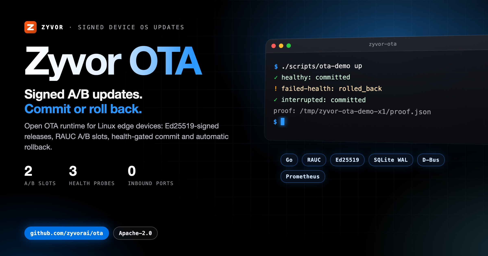
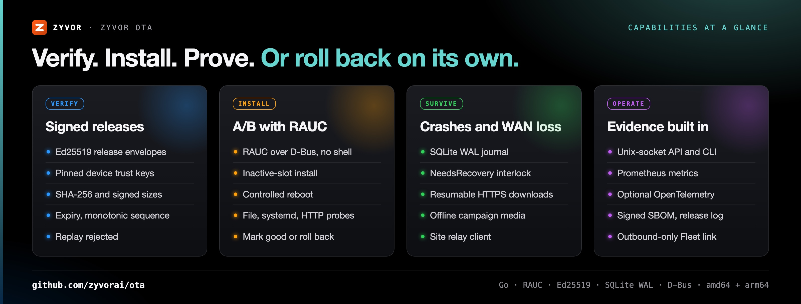
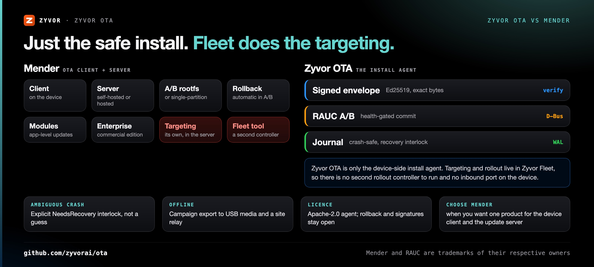
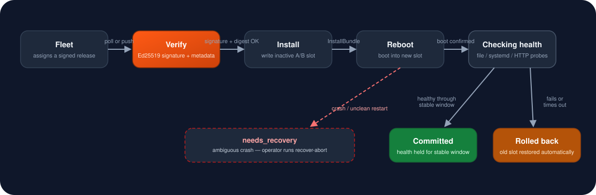
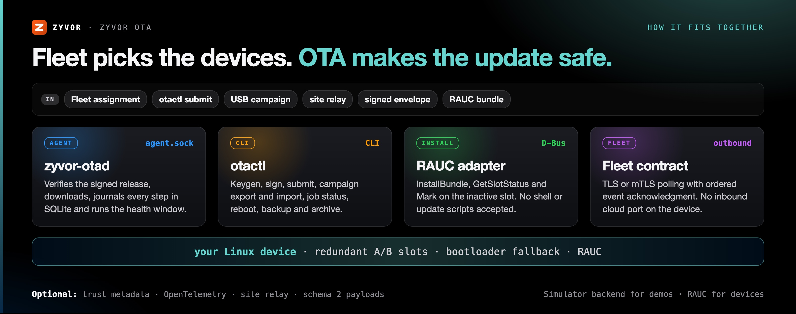

<div align="center">


# Zyvor OTA

[](https://github.com/zyvorai/ota/actions/workflows/ci.yml)
[](https://github.com/zyvorai/ota/actions/workflows/release.yml)
[](go.mod)
[](LICENSE)

[](https://zyvor.dev/schedule?utm_source=github&utm_medium=ota&utm_campaign=readme_hero)
[](https://zyvor.dev/poc?utm_source=github&utm_medium=ota&utm_campaign=readme_hero)
[](#quickstart)

[Tutorial](docs/TUTORIAL.md) · [User Guide](docs/USER-GUIDE.md) · [Architecture](docs/ARCHITECTURE.md) · [Operations](docs/OPERATIONS.md)



### Signed, recoverable device OS updates for the Zyvor Platform.

**The safest open OTA runtime for Linux edge fleets** — signed updates, automatic rollback, offline operation, and verifiable deployment evidence without cloud lock-in.

**Ed25519-signed releases** · **RAUC A/B slots** · **Health-gated commit** · **Automatic rollback** · **No inbound cloud port**

</div>

---

**v0.2.0 — engineering preview, Apache-2.0.** Working Go agent and CLI, native
RAUC D-Bus adapter, simulator, automated tests, and CI lab-substitutes.
**Generic QEMU RAUC lab HIL is complete** (`zyvor-ota-qemu-lab`); **Minewing
silicon qualification remains a separate, unsigned gate**. See
[verification evidence](docs/TEST-REPORT.md) and [HIL.md](docs/HIL.md).
The [roadmap](docs/ROADMAP.md) is what turns this engine into a 15-minute trial.

Fleet decides **which devices and when**. OTA verifies and installs a device OS
release. RAUC writes the inactive slot and integrates with the board bootloader.

## What's new

**v0.2.0 — engineering preview** ([changelog](CHANGELOG.md)):

| Area | What shipped |
|---|---|
| Crash-safe journal | SQLite journal with terminal-job archive, `otactl backup` and `otactl archive`; a legacy `state.json` is imported once |
| Schema 2 targets | `os.rauc`, `container.oci`, `config.bundle` and `model.oci` commit or roll back as one set; no shell handlers |
| Offline and constrained sites | Offline campaign export/import, local media, download window, bandwidth cap, jitter and a site relay client |
| Optional trust metadata | `trust_dir`: threshold root, delegated target types, snapshot and timestamp binding, signed SBOM, reject list and an append-only release log (no conformance claim, no TPM driver) |
| Operator CLI | `otactl` is the primary CLI; `zyvor-ota` stays a byte-identical alias |
| Lab HIL | Generic QEMU RAUC lab HIL complete (install, power-loss, reboots); Minewing silicon still unsigned |

## Why Zyvor OTA

| When this happens… | Zyvor OTA gives you… |
|---|---|
| An update image could be tampered with or replayed | Ed25519-signed exact-byte release envelopes, pinned device trust keys, expiry, a monotonic release sequence, and replay rejection |
| A bad update bricks devices in the field | Install to the inactive RAUC A/B slot, a local health window, then mark-good or automatic rollback |
| The agent crashes mid-install and nobody knows the outcome | A durable SQLite (WAL) journal and an explicit `NeedsRecovery` interlock for ambiguous outcomes |
| Sites have slow, metered or no WAN | Resumable HTTPS downloads, download windows, bandwidth caps, offline campaign media and a site relay |
| Security won't accept an inbound management port | An outbound-only Fleet contract over TLS or mTLS, polling with ordered event acknowledgment |
| An auditor asks what was installed and when | Prometheus metrics, optional OpenTelemetry spans, a signed SBOM check and an append-only release log |



---

## Zyvor OTA vs Mender



| | **Zyvor OTA** | **Mender** (OTA client + server) |
|---|---|---|
| Scope | Signed A/B install agent only | Device client plus a management server (self-hosted or hosted) |
| Targeting and rollout | Separate concern — Zyvor Fleet implements [docs/FLEET.md](docs/FLEET.md) | Built into the Mender server |
| Update mechanism | RAUC-managed A/B slots | A/B or single-partition, plus update modules |
| Rollback | Automatic, health-check gated, with an explicit `NeedsRecovery` interlock for ambiguous crashes | Automatic in A/B mode |
| Release trust | Ed25519 envelopes with pinned keys, expiry, monotonic sequence; optional threshold root and signed SBOM | Signed artifacts |
| Offline | Campaign export/import to local media and a site relay client | Standalone mode for local installs |
| Licence | Apache-2.0 | Apache-2.0 core + commercial Enterprise |
| **Choose Mender when** | | You want one product for both the device client and the update server, and don't run Zyvor Fleet |

## Is this for you?

**Zyvor OTA** is the open (Apache-2.0) runtime that makes a Linux edge update
safe to ship: a signed release, an inactive A/B slot, health-gated commit, and
automatic rollback, including when the WAN is down. Zyvor Fleet decides which
devices and when. This repository does not ship a second rollout controller.
The outcome to look for is a signed update that either commits or returns to
the previous boot — with evidence. Start with the [15-minute trial](docs/TUTORIAL.md).



| | **Zyvor OTA** | Mender | SWUpdate | balena | Roll-your-own (dpkg/apt + scripts) |
|---|---|---|---|---|---|
| Scope | Signed A/B install agent only | Agent + optional management server | Embedded update framework (daemon only) | Full fleet + container-based OS update, via balenaCloud | Whatever you script |
| Update mechanism | RAUC-managed A/B slots | A/B or single-partition | A/B, single-copy, or custom | balenaOS + container layer swap | Package manager, no atomicity guarantee |
| Rollback | Automatic, health-check gated, with an explicit `NeedsRecovery` interlock for ambiguous crashes | Automatic (A/B mode) | Depends on integration | Automatic (balenaOS) | Usually none |
| License | Apache-2.0 | Apache-2.0 core + commercial Enterprise | GPL-2.0 | Apache-2.0 agent + proprietary balenaCloud | N/A |
| Fleet/targeting | Separate concern — Zyvor Fleet implements `docs/FLEET.md` (`/v1/devices` + `/api/v1/ota`); lab stack in `docs/LAB.md` | Mender server (open or hosted) | Not included — typically paired with hawkBit or a custom backend | balenaCloud (proprietary) | You build it |

*(General characterizations as of writing — verify current licensing/features
against each project's own docs. Eclipse hawkBit and Uptane are not included
as direct rows: hawkBit is primarily a fleet/backend component comparable to
Fleet+OTA combined, and Uptane is a security framework some of the above
implement, not a competing product — Zyvor OTA does not currently claim
Uptane conformance.)*

**Maturity, stated honestly**: **v0.2.0 engineering preview** — working agent,
CLI, RAUC adapter, simulator, CI, and **generic QEMU RAUC lab HIL**
([docs/HIL.md](docs/HIL.md) Track A). **Minewing GW1 r1 silicon** is still
unsigned ([docs/PRODUCTION.md](docs/PRODUCTION.md)). If you need Minewing
board-qualified OTA today, evaluate accordingly.

New here? [`docs/FAQ.md`](docs/FAQ.md) covers licensing, support, and
production-readiness questions; [`docs/TROUBLESHOOTING.md`](docs/TROUBLESHOOTING.md)
covers real operational issues with their documented fix.

---

## How it fits together



Fleet decides **which devices and when**. OTA verifies and installs a device OS
release. RAUC writes the inactive slot and integrates with the board bootloader.
There is intentionally no second fleet dashboard or competing application rollout
controller in this repository. Detail: [architecture](docs/ARCHITECTURE.md) ·
[Fleet contract](docs/FLEET.md) · [lab stack](docs/LAB.md).

---

## Quickstart

New here? Start with the [15-minute trial](docs/TUTORIAL.md), or run the full simulator demonstration below.

<a id="run-the-complete-simulator-demonstration"></a>

### Run the complete simulator demonstration

Requirements: Linux, Go 1.27.1 or a newer supported patch (Go 1.24 is the language minimum),
Python 3 for the demo, GCC for race tests, and `dbus-daemon` for protocol tests.

```sh
make build
make test
make race
make vet
make demo
make help
make ci
make status          # bin/otactl; zyvor-ota is the same binary
```

`bin/otactl` and `bin/zyvor-ota` are the same CLI. `otactl status` is the colorful banner; `otactl status json` is the raw agent JSON the lab scripts parse.

The demo generates temporary signing keys, starts a local artifact server and
the **real daemon and CLI**, installs two simulated releases, restarts the daemon
before reboot, commits the first release, rolls back the unhealthy second release,
rejects replay, acknowledges events, and cleans the cache. It never writes disks,
calls system reboot, or contacts a Fleet deployment. Temporary keys are deleted.

Use `make dist` to cross-compile static Linux AMD64 and ARM64 executables.
An ARM64 build is not evidence of execution on ARM64 hardware.

## Implemented

- Ed25519-signed exact-byte release envelopes; pinned device trust keys.
- SHA-256 and signed artifact sizes, exact board/backend compatibility, expiry,
  monotonic release sequence, job idempotency, and maintenance windows.
- HTTPS downloads with host allowlists, safe redirect checks, bounded size,
  disk reserve, resumable ranges, full digest verification, and cache cleanup.
- Durable single-writer SQLite journal (WAL) and event outbox. Terminal jobs
  archive instead of bricking the agent; unacknowledged events are not dropped.
- RAUC `InstallBundle`, `Completed`, `GetSlotStatus`, `GetPrimary`, and `Mark`
  over D-Bus. No shell commands or arbitrary update scripts are accepted by OTA.
- A/B install, controlled reboot, local health window, mark-good and rollback.
- Recovery interlock when an installation's outcome is ambiguous after a crash.
- Health confirmation on later normal boots of known installed versions.
- File, systemd-service and loopback HTTP health probes.
- Unix-socket operator API, CLI, and Prometheus text metrics. Optional OpenTelemetry spans when `otlp_endpoint` is set.
- Outbound Fleet contract with TLS, optional custom CA/mTLS, token-file auth,
  ordered event acknowledgment, retry by polling, and no inbound cloud port.
- Schema 2 typed targets, offline campaign export/import, local media, download
  window, bandwidth cap, jitter, and a site relay client.
- Optional threshold root, delegated target types, snapshot and timestamp
  binding, signed SBOM, and an append-only release log. No TPM driver.
- systemd and policy examples, API schema, CI, release build/SBOM/Cosign workflow.

## Scope and support matrix

| Capability | Status |
|---|---|
| Simulator install/reboot/rollback | Implemented and software tested |
| RAUC D-Bus wire protocol | Implemented; tested against a test service on a real private bus |
| Real signed RAUC bundles on physical devices | Adapter implemented; board qualification required |
| Kernel/rootfs/device tree/BSP | Delivered together through a board-built RAUC OS bundle |
| Schema 2 side payloads (`container.oci`, `config.bundle`, `model.oci`) | Implemented as verified file copies with the previous digest kept for rollback. No shell handler |
| SWUpdate `.swu` | Not implemented |
| MCU firmware | Not implemented. No script handler is accepted |
| Bootloader update | Not enabled by this project; requires a qualified board recovery design |
| Fleet integration | Contract and transport implemented; Zyvor Fleet serves the matching endpoints |
| Site relay and offline campaign | Implemented. Digest check is the same as HTTPS |
| Optional trust metadata | Implemented when `trust_dir` is set. Not a conformance claim. No TPM driver |
| QEMU bootable image | Build recipe in [docs/QEMU-LAB.md](docs/QEMU-LAB.md). Generic lab HIL is signed. A disk copy lives at `$HOME/zyvor-qemu-lab/disk.img` and on lab host `80.79.5.173`. It is not a GitHub release asset |
| Hardware power-loss testing | Generic QEMU lab signed 2026-09-14. Minewing GW1 r1 is unsigned |

## Device deployment

Read [device integration](docs/DEVICE-INTEGRATION.md) before using the RAUC backend.
The initial image must already provide redundant slots, a working bootloader
fallback policy, a shared persistent OTA state directory, RAUC trust anchors,
and a recovery method. This project does not repartition existing devices.

1. Build a board image and real `.raucb` with the BSP's image build system
   (Minewing GW1 r1 profile: `boards/minewing-gw1-r1/`).
2. Give the RAUC bundle and signed OTA release the same unique version.
3. Provision the pinned Ed25519 public key and the RAUC X.509 trust anchor.
4. Configure `boards/minewing-gw1-r1/agent.json` (or `examples/agent.rauc.json`) for the board and artifact host.
5. Bake binaries/unit/D-Bus/polkit with `scripts/bake-rootfs-overlay.sh`, or install equivalently.
6. Start the agent and submit a signed assignment through its Unix socket or Fleet (`zyvor-fleet-ref` for lab).
7. Qualify reboot, rollback and power interruption per `docs/QUALIFICATION.md`.

The daemon defaults to the configured backend; the example development flow
explicitly uses `simulator`. RAUC requires `allow_device_writes: true` and at least
one local health check. Simulator releases cannot be installed by the RAUC backend.

```sh
otactl keygen ./release-keys
# Fill examples/release.json with the actual artifact URL, SHA-256, size and expiry.
otactl sign release.json release-keys/release.key production-1 envelope.json
# Embed envelope.json as the release field in assignment.json.
otactl -socket /run/zyvor-ota/agent.sock submit assignment.json
otactl campaign-export assignment.json ./artifacts /media/usb/campaign
otactl campaign-import /media/usb/campaign /var/lib/zyvor-ota/media
otactl -socket /run/zyvor-ota/agent.sock job job-001
otactl -socket /run/zyvor-ota/agent.sock reboot
```

`zyvor-ota` is the same binary as `otactl` (compat alias in `bin/`, packages, and baked rootfs).

Keep the signing private key off the device. Examples contain placeholders,
not working production credentials or pre-signed firmware.

## Remote smoke-deploy

`scripts/deploy-remote.sh` pushes a build to an arbitrary Linux host over SSH,
runs `make check && make demo` there, and installs it as a systemd service
running the simulator backend, then drives one real signed install/reboot/
commit job cycle against that live daemon. It never touches RAUC, D-Bus, or
real disks, and it does **not** replace the device deployment steps above —
see [`deploy/README.md`](deploy/README.md) for what it does and does not do.

```sh
scripts/deploy-remote.sh HOST USER --key
make deploy-remote H=HOST U=USER
```

## Repository guide

| Directory | Purpose |
|---|---|
| `cmd/` | Operator CLI and device daemon |
| `internal/ota/` | Engine, journal, verification, downloader, backends, API, Fleet |
| `api/` | OpenAPI and release JSON schema |
| `examples/` | Config/release/assignment templates |
| `boards/minewing-gw1-r1/` | Selected production SKU profile (Minewing GW1 r1), bake inputs |
| `boards/reference/` | Generic RAUC templates, not a certified image |
| `packaging/` | systemd, D-Bus and polkit policy examples |
| `deploy/` | Remote smoke-deploy tooling (simulator backend, not board deployment) |
| `scripts/` | Daemon E2E, qualify matrix, bake/render, checksums, remote deploy |
| `docs/` | Architecture, security, recovery, device qualification and test evidence |

See [architecture](docs/ARCHITECTURE.md), [Fleet contract](docs/FLEET.md),
[lab stack](docs/LAB.md), [operations](docs/OPERATIONS.md), the
[tutorial](docs/TUTORIAL.md), and the [user guide](docs/USER-GUIDE.md). There
is intentionally no second fleet dashboard or competing application rollout
controller in this repository.

---

## Maturity

**Maturity, stated honestly**: **v0.2.0 engineering preview** — working agent,
CLI, RAUC adapter, simulator, CI, and **generic QEMU RAUC lab HIL**
([docs/HIL.md](docs/HIL.md) Track A). **Minewing GW1 r1 silicon** is still
unsigned ([docs/PRODUCTION.md](docs/PRODUCTION.md)). Not claimed: physical Minewing
RAUC/power-loss qualification, Uptane conformance, a TPM driver, SWUpdate `.swu`, MCU firmware
and bootloader updates. Evidence: [docs/TEST-REPORT.md](docs/TEST-REPORT.md) ·
[roadmap](docs/ROADMAP.md) · [FAQ](docs/FAQ.md).

---

## Part of the Zyvor stack

| Product | Role next to Zyvor OTA |
|---|---|
| **Zyvor OTA** | Signed, health-gated A/B device OS updates with automatic rollback |
| **[Fleet](https://github.com/zyvorai/zyvorai-fleet)** | Decides which devices and when; serves the `/v1/devices` and `/api/v1/ota` endpoints of the Fleet contract |
| **[Zyvor Device Agent](https://github.com/zyvorai/zyvor-device-agent)** | Hardware inventory on the same gateway; part of the Fleet + OTA + Device Agent [lab stack](docs/LAB.md) |
| **[Yard](https://github.com/zyvorai/yard)** | Asset registry; its OTA connector lists campaigns while execution stays in OTA |
| **[Nodra](https://github.com/zyvorai/nodra)** | Offline-first edge runtime; runs next to OTA in the lab topology |

→ [zyvor.dev](https://zyvor.dev)

---

## Contributing

See [CONTRIBUTING.md](CONTRIBUTING.md): Apache-2.0 SPDX headers, board profiles
scoped to a tested SKU/revision pair, and required evidence for any change to
boot selection, slot grouping, signing or recovery behavior. Run `make check`,
`make demo`, and `make dist` before opening a pull request.

## Security

See [SECURITY.md](SECURITY.md) for the threat model this agent defends and how
to report a suspected vulnerability. Never post signing keys, device
credentials, or exploitable production details in a public issue.

## License

Zyvor OTA is **free and open source** under the [Apache License, Version 2.0](LICENSE).
You may use, modify, and run it for personal, lab, and commercial production
use at no charge, subject to Apache-2.0 (preserve notices / NOTICE where required).
Original Zyvor OTA source is Apache-2.0. Vendored dependencies retain their own licenses. RAUC is an external runtime dependency and is not relicensed by this project.

**Zyvor Enterprise** adds what production teams ask for: supported releases, deployment and upgrade guidance, priority incident triage, a named technical contact and 24x7 critical intake. Customers pay for operational leverage, not for rollback or signature checks.
Those stay in the Apache-2.0 agent. Enterprise is the Fleet dashboard, SSO and
approvals, site relay, compliance evidence, certified board enablement, and
support. See the [FAQ](docs/FAQ.md#community-and-enterprise). Plans and terms: [docs/SUBSCRIPTION-MODEL.md](docs/SUBSCRIPTION-MODEL.md) · [Pricing](https://zyvor.dev/pricing?utm_source=github&utm_medium=ota&utm_campaign=readme_license) · [sales@zyvor.dev](mailto:sales@zyvor.dev).

---

<div align="center">

### Ship device updates that commit or roll back

[](https://zyvor.dev/schedule?utm_source=github&utm_medium=ota&utm_campaign=readme_footer)
[](https://zyvor.dev/poc?utm_source=github&utm_medium=ota&utm_campaign=readme_footer)
[](https://zyvor.dev/pricing?utm_source=github&utm_medium=ota&utm_campaign=readme_footer)
[](mailto:sales@zyvor.dev?subject=Zyvor%20OTA)
[](https://github.com/zyvorai/ota)

</div>
