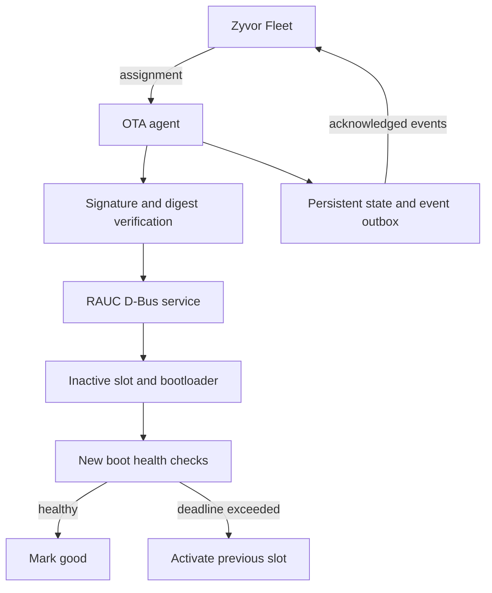

---
hero:
  eyebrow: ARCHITECTURE
  title: Architecture and invariants
  lead: One durable job state machine carries every accepted assignment from acceptance through commit — or an automatic, health-checked rollback — guarded end to end by a single-writer journal and a per-device anti-replay sequence.
  highlights:
    - {value: "12", label: "States in the job lifecycle machine"}
    - {value: "2", label: "Bootable A/B rootfs slots"}
    - {value: "10,000", label: "Retained jobs & outbox events, bounded by design"}
---

## State machine

Accepted → Downloading → Verified → Installing → AwaitingReboot → CheckingHealth
→ Committing → Committed. CheckingHealth can enter RollbackPending and then
RolledBack. Errors before installation may enter Failed. Any ambiguous installation
or slot identity enters NeedsRecovery and blocks further jobs.

`Installing` is persisted before asking RAUC to write. A process restart in this
state enters NeedsRecovery even if a target version appears installed. That version
alone cannot prove all grouped images were written and the request completed.
The only built-in operator resolution is recover-abort on the original slot with
an idle backend. A successful retry requires a newly signed release sequence and
unique version. No API bypasses signature or sequence checks.

The controller must deliver assignments at least once. Identical job IDs/content
return the existing job, including after completion. A different assignment with
the same ID is rejected. A per-device sequence high-water mark is reserved when
an assignment is accepted, including assignments which later fail. This prevents
replay after rollback. The last known working slot can still be selected locally
without accepting an older remote release.

## Persistence choice

The proposed SQLite layer is implemented as a **single-writer snapshot journal**
in this version: a bounded JSON database, advisory process lock, temporary file,
file fsync, atomic rename, and parent-directory fsync. This keeps the runtime
dependency footprint small while preserving atomic job/event transactions.

The local filesystem must honor fsync and rename durability. Use persistent ext4
or an equivalently qualified local filesystem shared by both slots. Do not use
tmpfs, overlay ephemeral state, NFS, or a filesystem inside only one OS slot.
Storage failures poison the in-process store and block further state mutations;
they do not silently reset the high-water mark. Corrupt or unknown state fails startup.

The limits are 10,000 retained jobs and 10,000 unacknowledged events. New jobs are
rejected when retention reaches its bound, or when the outbox exceeds 9,000 events.
No unacknowledged event is dropped to make space. See OPERATIONS for retention.

## Installation and boot

- Exactly two bootable `rootfs` slots are supported. Kernel/DTB partitions can be
  grouped under their rootfs in RAUC. The agent does not choose raw block devices.
- Slot names, current version, current boot ID and intended target are recorded.
- Downloads and preinstall verification can be retried before their deadline.
- The verified cached bytes are hashed again immediately before installation.
- RAUC owns the flash operation; canceling the agent does not kill the RAUC service.
- A Completed signal is necessary for the live install path, followed by observed
  primary slot/version checks. The agent subscribes before calling InstallBundle.
- Reboot into a target with an unexpected version is not committed.
- Commit intent is durable before Mark(good). Retrying that mark is idempotent.
- Local health starts only after the boot ID changes. Healthy stability restarts
  after agent restart; the absolute health deadline does not reset.
- A second reboot during health/commit forces fresh health checks.
- Recovery reboots after failed health are allowed outside the rollout window.
- Later ordinary boots are health-confirmed only for versions associated with
  the latest completed OTA transaction. Factory boot confirmation belongs to
  initial board provisioning until the first update has completed.

The bootloader and hardware watchdog must recover a kernel/initramfs hang before
userspace starts. The daemon cannot repair a boot in which it never runs.

## Process boundaries

Run OTA as the dedicated `zyvor-ota` user. RAUC remains a separate privileged
service. Grant the OTA user only the required RAUC methods and noninteractive
reboot action. Other local updaters and automatic mark-good services must not
compete with OTA. Restrict access to the agent socket and persistent directory.

The operator API normally binds only a mode-0600 Unix socket. For automated demo
tests, `-simulation-listen 127.0.0.1:PORT` exposes the same API on loopback but is
rejected with the RAUC backend. This unauthenticated demo endpoint can only mutate
simulator files; do not expose it through a proxy.

## Three ways a job ends

- **Committed** — health held continuously through `health_stable_seconds`.
  Commit intent is persisted durably before `Mark(good)` is called, and
  retrying that mark is idempotent.
- **Rolled back** — health failed or the deadline was exceeded. The backend
  restores the old slot automatically; no operator action is needed, and a
  new, higher-sequence release is required to try again.
- **NeedsRecovery** — a crash left the installation outcome ambiguous. The
  agent blocks further jobs rather than guessing, until an operator runs
  `recover-abort` (or the board recovery path) and issues a newly signed
  sequence — see [Operations §NeedsRecovery](OPERATIONS.md#needsrecovery).

